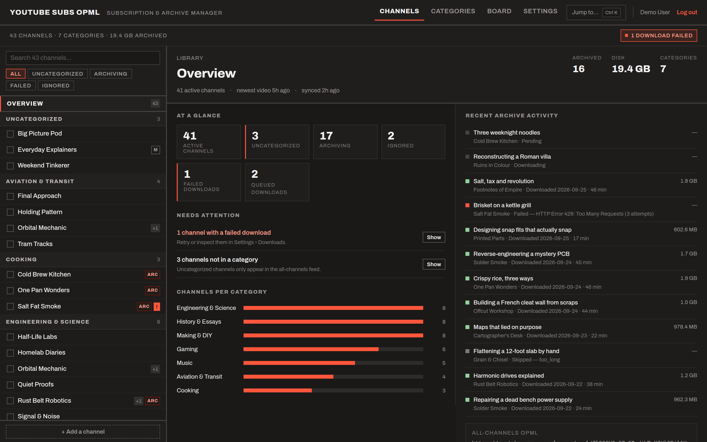
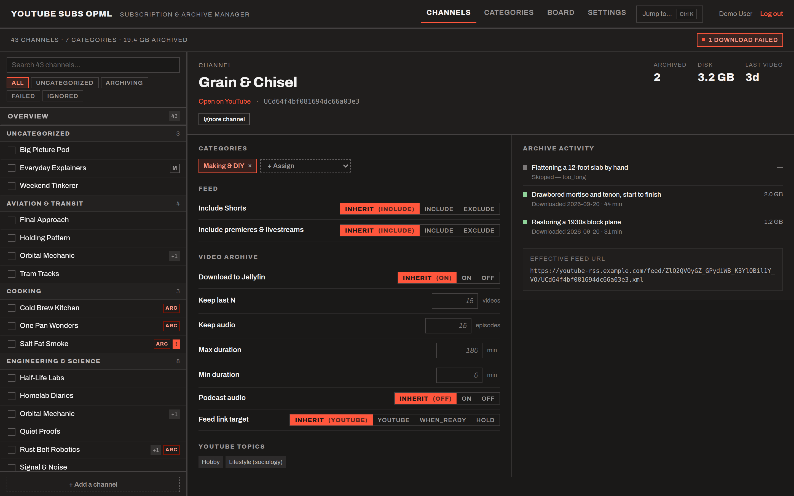
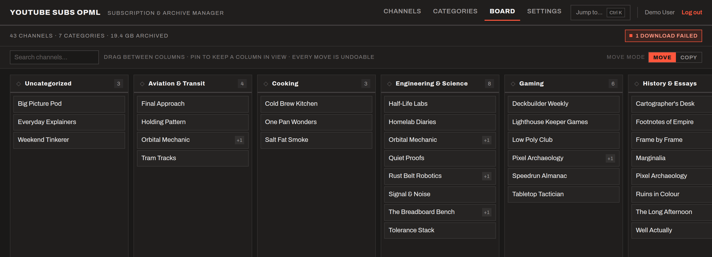
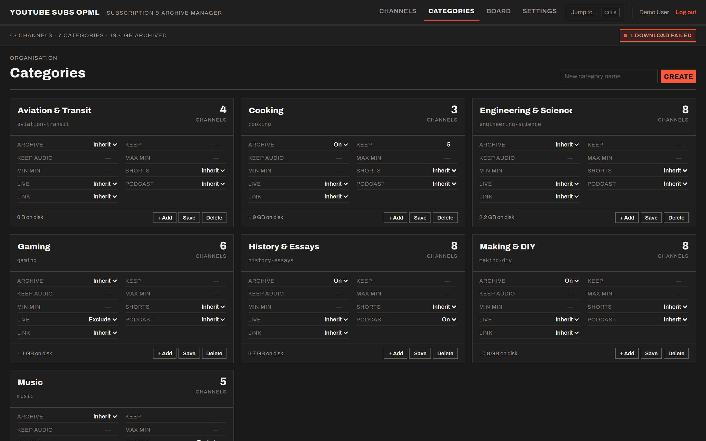
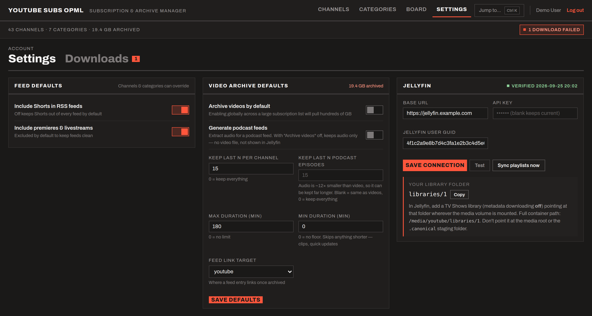

# YouTube Subscriptions OPML Manager

A multi-user web app that syncs YouTube subscriptions via the YouTube Data API and exposes them as categorized OPML feeds. Designed for self-hosted setups where an RSS reader like FreshRSS pulls subscription feeds on a schedule.



## Features

**Subscriptions**

- OIDC login for providers such as Keycloak, Authentik, Authelia, etc.
- Per-user YouTube OAuth, with automatic subscription sync (every 6 hours)
- Add channels by hand from a URL, `@handle`, or channel ID, including Nebula channels
- Ignore channels you don't want in any feed

**Feeds**

- Organize channels into user-defined categories, from a list view or a drag-and-drop board
- Token-authenticated OPML endpoints for RSS readers (`/opml/<token>/all.opml`, `/opml/<token>/<category-slug>.opml`)
- Feeds are served from a cache refreshed by a background poller, so a reader fetching every feed at once doesn't get the server throttled by YouTube
- Filter out Shorts and premieres/livestreams per user, category, or channel (cascading preference: channel > category > user)

**Video archive**

- Download new videos into Jellyfin, with per-user libraries that share files on disk via hardlinks
- Retention and length limits: keep the last N videos per channel, skip videos over or under a set duration
- Per-category Jellyfin playlists, and optionally point feed entries at the Jellyfin copy once it's downloaded
- Podcast feeds (`/podcast/<token>/all.xml`, `/podcast/<token>/<category-slug>.xml`) with extracted audio, including audio-only channels that don't keep the video
- A downloads view for failed and skipped items, with manual retry

**Getting around**

- A library overview with archive activity and anything that needs attention
- A Ctrl/Cmd-K quick switcher for jumping to any channel









## Prerequisites

- Docker and Docker Compose
- A Google Cloud project with the YouTube Data API v3 enabled and a Web application OAuth client

Authentication can either be managed via:
- An OIDC provider (Keycloak, Authentik, Authelia, or any OpenID Connect-compatible identity provider)
- A single local user, enabled with the `LOCAL_MODE` environment variable

## Setup

### 1. External services

**OIDC provider:**
1. Create an OIDC client (Authorization Code flow) in your identity provider.
2. Set the valid redirect URI to `<BASE_URL>/auth/callback`.
3. The provider must support OpenID Connect Discovery (a `/.well-known/openid-configuration` endpoint).

**Google Cloud:**

1. Go to Cloud Console > Credentials > Create OAuth client ID. Select **Web application** (not Desktop).
2. Set the authorized redirect URI to `<BASE_URL>/auth/youtube/callback`.
3. Enable the **YouTube Data API v3** on the same project.
4. Set the OAuth consent screen's publishing status to **In production**. In Testing mode, Google expires refresh tokens after 7 days, so connected accounts stop syncing weekly until reconnected. The `youtube.readonly` scope is "sensitive", so an unverified app shows a "Google hasn't verified this app" warning when connecting and is capped at 100 users. Neither matters for household use, and no verification review is needed.
5. Optionally, create an **API key** restricted to the YouTube Data API v3 and set it as `YOUTUBE_API_KEY`. When YouTube's RSS feeds fail (they sometimes 404 every request from a server for hours), the poller reads a channel's recent uploads from the API instead, at most once per channel per hour.

### 2. Configure environment

```bash
cp .env.example .env
```

If you're using auth via an OIDC provider, fill in the values:

| Variable | Description |
|---|---|
| `POSTGRES_PASSWORD` | Database password |
| `SESSION_SECRET` | Random string for cookie signing. Generate: `python -c "import secrets; print(secrets.token_urlsafe(32))"` |
| `FERNET_KEY` | Encryption key for stored refresh tokens. Generate: `python -c "from cryptography.fernet import Fernet; print(Fernet.generate_key().decode())"` |
| `BASE_URL` | Public URL of the app (e.g. `https://youtube-rss.example.com`) |
| `OIDC_ISSUER` | OIDC issuer URL (e.g. `https://sso.example.com/realms/myrealm`) |
| `OIDC_CLIENT_ID` | OIDC client ID |
| `OIDC_CLIENT_SECRET` | OIDC client secret |
| `YOUTUBE_CLIENT_ID` | Google OAuth client ID |
| `YOUTUBE_CLIENT_SECRET` | Google OAuth client secret |
| `YOUTUBE_API_KEY` | Optional. Data API key used when a channel's RSS feed fails |
| `YOUTUBE_API_FALLBACK_INTERVAL_MINUTES` | Optional. Minimum minutes between API fallbacks per channel (default 60; each costs 1 of the 10,000/day quota units) |


If you're only planning on using the local setup and don't require OIDC or YouTube client support,
then just set `LOCAL_MODE=1` in your environment config.

### 3. Run

```bash
docker compose up -d
```

The app runs database migrations on startup automatically. It will be available on port 8000.

## Local development

```bash
docker compose up -d db
uv sync --extra web
uv run --extra web alembic upgrade head
uv run --extra web uvicorn youtube_subs_opml.web.main:app --reload
```

`DATABASE_URL` must be set for Alembic when running outside Docker:

```bash
DATABASE_URL=postgresql+psycopg://yts:<password>@localhost:5432/yts uv run --extra web alembic upgrade head
```

### Tests and linting

Ruff (lint + format) and Pyrefly (type checking) are configured in `pyproject.toml`
and run in CI, along with the test suite, on every push and pull request.

```bash
uv sync --all-extras
uv run pytest
uv run ruff check .          # add --fix to apply safe fixes
uv run ruff format .
uv run pyrefly check
```

## CLI

A standalone CLI tool is available for one-shot OPML export without the web app:

```bash
uv sync
uv run youtube-subs-opml
```

This uses a separate Desktop OAuth flow and writes OPML to stdout.
